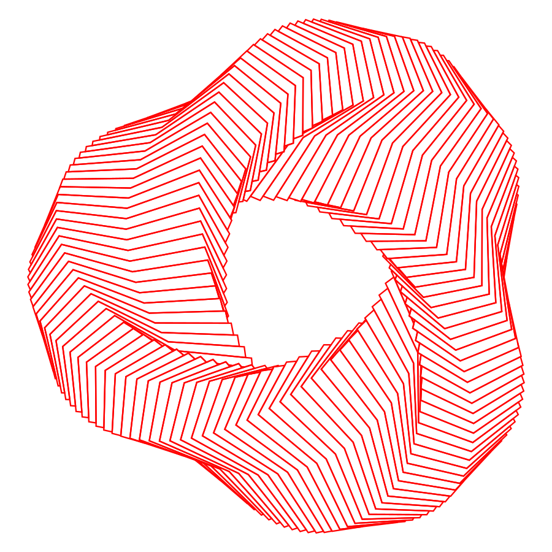
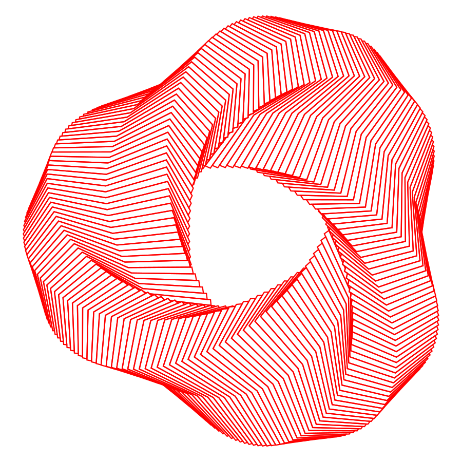
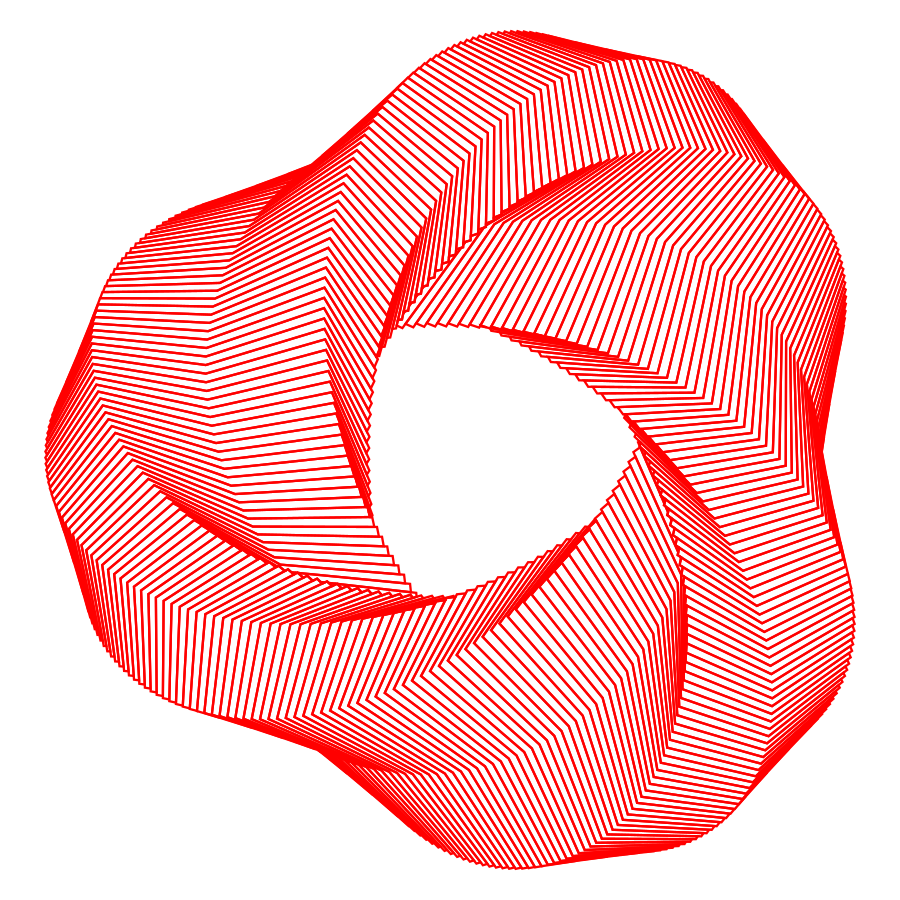

# Drawscape Logo


## Count variations

| 50 profiles | 100 profiles |
| --- | --- |
| [](output/logo-count-050.svg) | [](output/logo-count-100.svg) |
| 150 profiles | 200 profiles |
| [](output/logo-count-150.svg) | [](output/logo-count-200.svg) |

Select any preview to open its SVG source.

## Run

Requires Node.js 20.9 or later.

```sh
npm ci
npm run generate
```

Files are saved in `output/`:

- `logo-generated.svg`: 300 x 300 mm.
- `logo-generated.png`: 1800 x 1800 pixels, white background.

Each run replaces these files.

## Options

All options are optional. Use one size value for both width and height.

```sh
# 200 x 200 mm
node generate.js --size 200

# Fewer shapes and thin black lines
node generate.js --count 100 --stroke-width 0.3 --color '#000000'

# Save a separate SVG and PNG
node generate.js --output output/custom.svg

node generate.js --help
```

Use `--margin` for the page margin in mm and `--png-size` for the PNG width in pixels.
Run `node generate.js --help` for all options.

## Test

```sh
npm test
```

## License

This work is licensed under [CC BY 4.0](https://creativecommons.org/licenses/by/4.0/deed.en).

## Attribution

This design is a reconstruction of Julien Espagnon's artwork [Impossible Shape](https://plotterfiles.com/artwork/impossible-shape-c4ec2e74).
