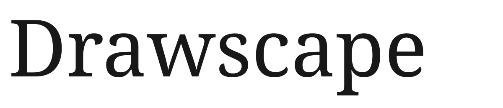
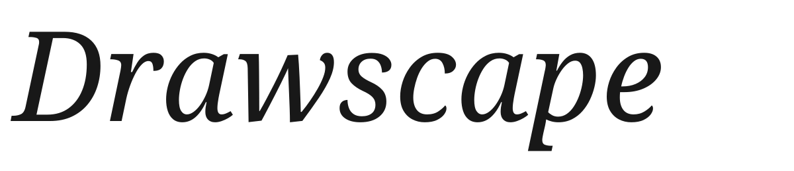
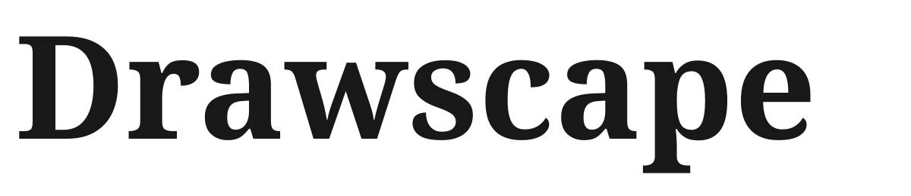
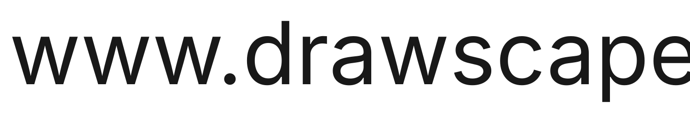
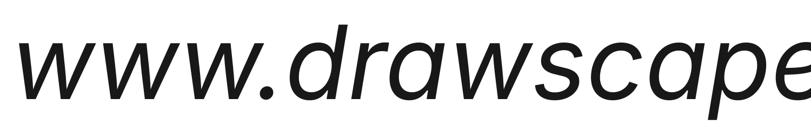
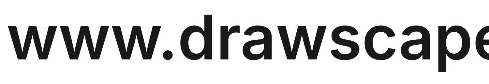
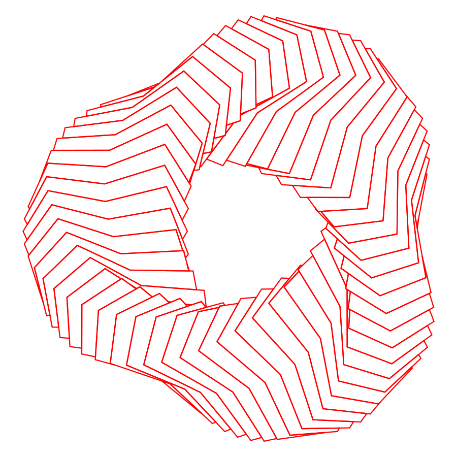
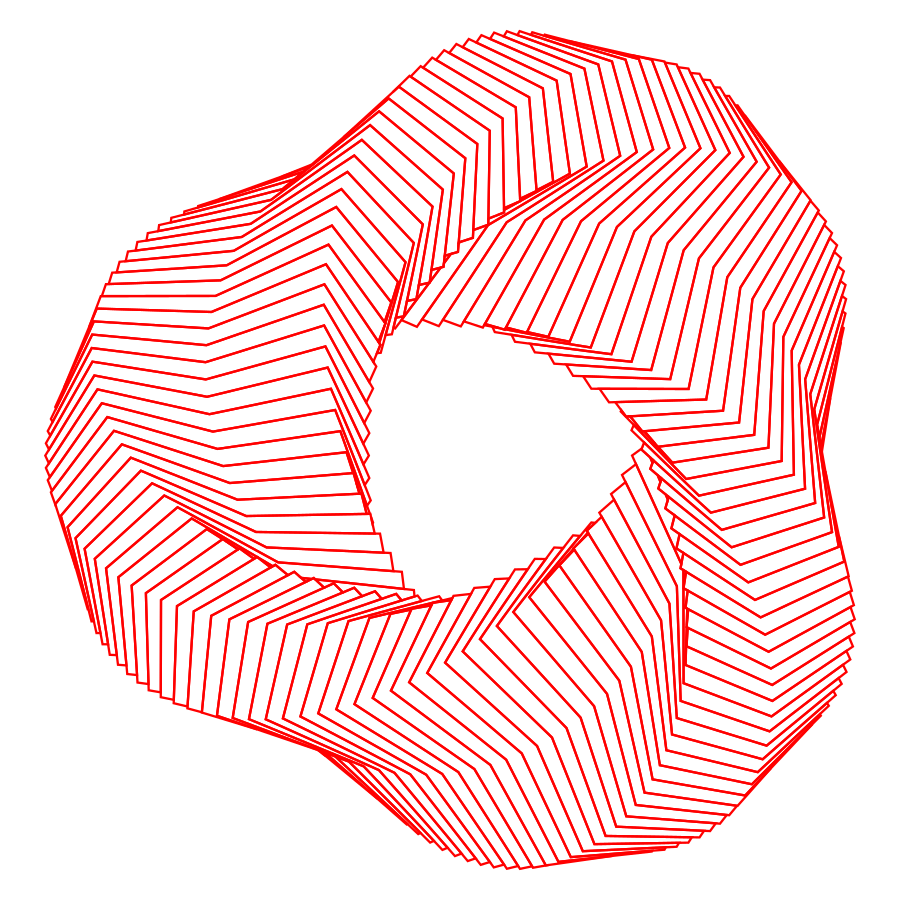

# Drawscape Logo


## Font examples

### Primary — Lora

| Regular | Italic | Semibold |
| --- | --- | --- |
|  |  |  |

```css
font-family: "Lora", serif;
```

### Secondary — Inter Variable

| Regular | Italic | Semibold |
| --- | --- | --- |
|  |  |  |

```css
font-family: InterVariable, Inter, sans-serif;
```

## Count variations

| 50 profiles | 100 profiles |
| --- | --- |
| [](output/logo/logo-count-050.svg) | [](output/logo/logo-count-100.svg) |
| 150 profiles | 200 profiles |
| [](output/logo/logo-count-150.svg) | [](output/logo/logo-count-200.svg) |

## Attribution

This design is a reconstruction of Julien Espagnon's artwork [Impossible Shape](https://plotterfiles.com/artwork/impossible-shape-c4ec2e74).

## Run

Requires Node.js 20.9 or later.

```sh
npm install
npm run generate
```

Files are saved in `output/`:

- `logo/logo-generated.svg`: 300 x 300 mm.
- `logo/logo-generated.png`: 1800 x 1800 pixels, white background.
- `font/drawscape-lora-*.svg`: Lora wordmark examples.
- `font/drawscape-inter-*.svg`: Inter Variable website-address examples.
- `font/InterVariable*.woff2`: bundled website fonts used by the Inter SVGs.

Each run replaces these files.

## Options

All options are optional. Use one size value for both width and height.

```sh
# 200 x 200 mm
node generate.js --size 200

# Fewer shapes and thin black lines
node generate.js --count 100 --stroke-width 0.3 --color '#000000'

# Save a separate SVG and PNG
node generate.js --output output/custom.svg

node generate.js --help
```

Use `--margin` for the page margin in mm and `--png-size` for the PNG width in pixels.
Run `node generate.js --help` for all options.

## How it works

The construction is in [logo.js](logo.js):

1. Mirror four points through the origin to make a bent, eight-sided profile.
2. Move copies around a circle, turning each profile half as far in the opposite direction.
3. Cut each profile beneath the next third of the ring to create the woven crossings.

Clipping happens one covering profile at a time, so each cut works on the remaining
visible pieces.

The motion is just a circle and a half turn:

```js
const angle = 2 * Math.PI * i / count;
const center = [-radius * Math.cos(angle), radius * Math.sin(angle)];
const turn = angle / 2;
```

The profile's symmetry lets it close seamlessly after that half turn. Its four
points and radius are rounded design measurements for this reconstruction.

There are two external dependencies: `polygon-clipping` cuts the hidden geometry
out of the SVG paths, and `sharp` converts the SVG to PNG. File handling and command
line options live in [generate.js](generate.js) and use Node.js built-ins.

## Test

```sh
npm test
```

## License

This work is licensed under [CC BY 4.0](https://creativecommons.org/licenses/by/4.0/deed.en).
